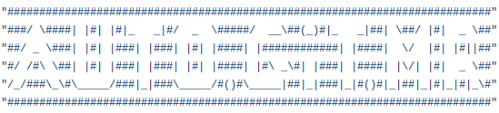
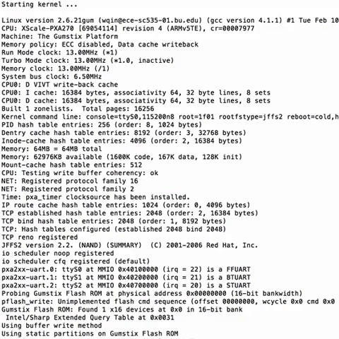

# Git-Auto-MR
Create gitlab merge requests automatically - Version 3.0

### If you create a lot of merge requests every day?
### If you you want to create merge requests in a cool way ?
### If you are sick from repeating the same thing every day ?

### Then you need :

# "GIT-AUTO-MR"

# What is AutoGitMR ?

*AutoGitMR is a git command, to create automatic merge requests on gitlab, version 3.0\
*Works on Linux &amp; windows operating systems\
*Name of the new command is : git lmr\
*Signification : Gitlab Merge request\

# How to install it?

## For windows users :

0- Download the installer of your operating system + git-lmr script\
1- On windows, open the bat file as administrator : gitAutoMR-WindowsInstaller.bat\
2- Then add the created folder : 'C:\gitAutoMR' to your PATH variable.\

## For linux/Unix users :

0- Download the installer of your operating system + git-lmr script\
1-Open the terminal, type : sudo chmod +x gitAutoMR-LinuxInstaller.sh\
2-Run the installer, by typing : ./gitAutoMR-LinuxInstaller.sh\

# How to use it ?

*Now, the terminal, and cmd will recognize git lmr as a git command.\
*The command is :\
*git lmr <remote_branch [default=dev]>, if you didn't type anything after 'lmr', then a new MR will be created in (DEV or master) branch\
*Then the command will ask you two questions :\
*1) assignee_id : (type the id of the person who will accept your MR, by default the MR will be assigned to you)\
*2) labels : (give the identifiers of some labels separated by ','). Example : java,bugFixing,test\
*The title of the last commit is the title of your merge request\
*After that you will have a confirmation message, answer with : [y/n]\
*If everything works fine, you will be redirected automatically to your gitlab account to view your merge request details\

### Enjoy AutoGitMR \\[^_^]/
### Happy coding...
#### By Mostafa ACHRAF

